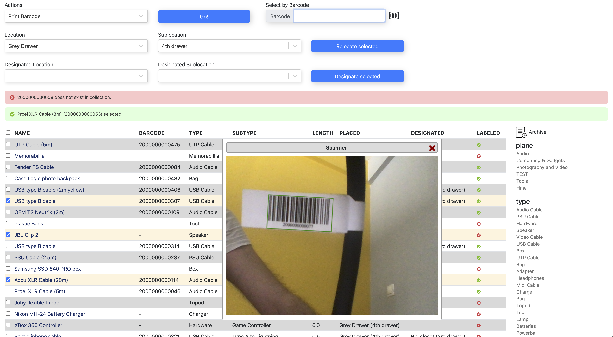
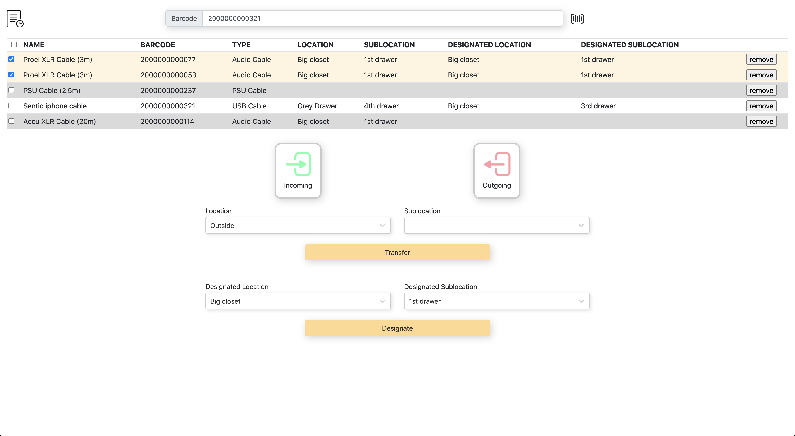

# tidy-inventory
Try it out here: https://tidy-demo.tziallas.net/browse

Organize your home inventory

Automates barcode generation and printing on cable label templates.

You can scan barcodes with a barcode scanner or with your device's webcam.

Responsive web application built with Postgres, Django, React-Redux, Webpack and Bootstrap.

Programmaticaly wraps Django Admin python APIs to expose them in a new REST API that is more suited for use with a React-Redux frontend.





## 📋 Installation
The application is dockerized so after you install Docker you can run:

```docker-compose up``` 
inside base folder (next to docker-compose.yml)

When the installation finisehs visit ```127.0.0.1:8000```. Enjoy!

<b>Note</b>: if you are running docker on windows, make sure /django/src/wait.sh file has linux style endings (LF, not CRLF)

## 📖 Documentation
Runtime is split into 3 containers (and corresponding folders):
- **db**: The postgres database
- **node**: A NodeJS container which holds all the frontent JS along with Webpack and Babel. It's used to host webpack-dev-server for hot-reload development.
- **django** : A container that holds all the backend python code. It's used to host the django development server.
